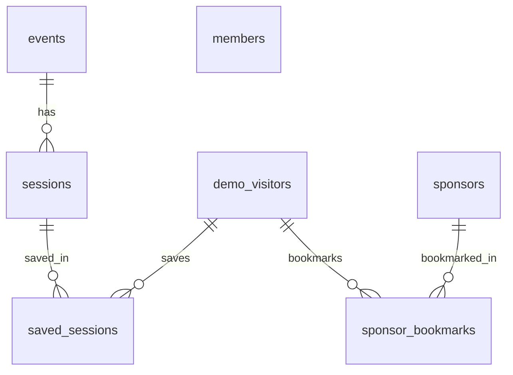

# Data model (demo v1)

> **Horizon:** demo  
> **Status:** applied  
> **Backend:** Supabase Postgres (`ca-central-1`), fake/test data only

Source requirements: [demo.md](demo.md). Migrations live in [`supabase/migrations/`](../../supabase/migrations/).

## ER overview



`members` is standalone (privacy-safe directory; no auth linkage).

## Enums

| Enum | Values |
|------|--------|
| `session_category` | `keynote`, `workshop`, `panel`, `networking`, `social` |
| `member_role` | `attendee`, `speaker`, `board_member`, `staff` |

## Tables

### `events`

| Column | Type | Notes |
|--------|------|-------|
| `id` | uuid PK | |
| `name` | text | Conference title |
| `slug` | text UNIQUE | URL key, e.g. `concretebc-2027` |
| `starts_on`, `ends_on` | date | Inclusive conference dates |
| `venue_name` | text | Default `Main Stage` |
| `summary` | text | Dashboard blurb |
| `created_at`, `updated_at` | timestamptz | Auto-maintained |

**Constraints:** `ends_on >= starts_on`

### `sessions`

| Column | Type | Notes |
|--------|------|-------|
| `id` | uuid PK | |
| `event_id` | uuid FK → `events` | ON DELETE CASCADE |
| `title`, `summary` | text | Session detail fields |
| `category` | `session_category` | Agenda filter |
| `conference_day` | smallint | 1–7 for day tabs |
| `starts_at`, `ends_at` | timestamptz | Overlap detection |
| `location` | text | Default `Main Stage` |
| `sort_order` | int | Stable ordering within a day |
| `created_at`, `updated_at` | timestamptz | |

**Constraints:** `ends_at > starts_at`; `conference_day` between 1 and 7

**Overlap rule (app layer):** sessions A and B overlap when `A.starts_at < B.ends_at AND A.ends_at > B.starts_at`.

### `sponsors`

| Column | Type | Notes |
|--------|------|-------|
| `id` | uuid PK | |
| `name` | text | Fake org name |
| `slug` | text UNIQUE | Profile URL key |
| `categories` | text[] | e.g. `{Gold Sponsor, Exhibitor}` |
| `booth_location` | text | Booth label |
| `overview` | text | Profile description |
| `sort_order` | int | Directory ordering |
| `created_at`, `updated_at` | timestamptz | |

No contact/outreach columns.

### `members`

| Column | Type | Notes |
|--------|------|-------|
| `id` | uuid PK | |
| `display_name` | text | Fake name only |
| `organization_name` | text | Fake org only |
| `role` | `member_role` | Directory filter |
| `bio` | text NULL | Optional short bio |
| `affiliation_tag` | text NULL | Optional tag |
| `sort_order` | int | |
| `created_at`, `updated_at` | timestamptz | |

**Not stored:** email, phone, photos, org contact details.

### `demo_visitors`

| Column | Type | Notes |
|--------|------|-------|
| `id` | uuid PK | Client-generated UUID (see below) |
| `label` | text NULL | Optional debug label |
| `created_at` | timestamptz | |

### `saved_sessions`

| Column | Type | Notes |
|--------|------|-------|
| `id` | uuid PK | |
| `demo_visitor_id` | uuid FK → `demo_visitors` | ON DELETE CASCADE |
| `session_id` | uuid FK → `sessions` | ON DELETE CASCADE |
| `saved_at` | timestamptz | |

**Unique:** `(demo_visitor_id, session_id)`

### `sponsor_bookmarks`

| Column | Type | Notes |
|--------|------|-------|
| `id` | uuid PK | |
| `demo_visitor_id` | uuid FK → `demo_visitors` | ON DELETE CASCADE |
| `sponsor_id` | uuid FK → `sponsors` | ON DELETE CASCADE |
| `bookmarked_at` | timestamptz | |

**Unique:** `(demo_visitor_id, sponsor_id)`

## Indexes

| Table | Index | Purpose |
|-------|-------|---------|
| `sessions` | `(event_id, conference_day, starts_at)` | Day tabs + chronological list |
| `sessions` | `(category)` | Category filter |
| `sessions` | `(starts_at, ends_at)` | Overlap queries |
| `sponsors` | GIN `(categories)` | Category filter |
| `sponsors` | GIN trgm `(name)` | Name search |
| `members` | `(role)` | Role filter |
| `members` | GIN trgm `(display_name \|\| ' ' \|\| organization_name)` | Search |
| `saved_sessions` | `(demo_visitor_id)`, `(session_id)` | FK lookups |
| `sponsor_bookmarks` | `(demo_visitor_id)`, `(sponsor_id)` | FK lookups |

Extension: `pg_trgm` (in `extensions` schema).

## No-auth prototype: `demo_visitor_id`

**Chosen pattern:** client-generated UUID stored in `localStorage` (or httpOnly cookie via API later).

**Rejected:** single shared demo profile — all users would overwrite the same saves/bookmarks.

| Operation | Access path |
|-----------|-------------|
| Read agenda, sponsors, members | Browser publishable key → PostgREST `SELECT` (anon RLS) |
| Create visitor, save/unsave sessions, bookmark sponsors | Next.js API routes → **service role** only |

**Why service role for writes:** without auth there is no trustworthy identity in JWT claims. API routes validate `demo_visitor_id` from the request and scope inserts/deletes. Never expose `SUPABASE_SERVICE_ROLE_KEY` to the client.

**Prototype tradeoff:** direct browser writes to `saved_sessions` / `sponsor_bookmarks` are blocked (no anon policies, no grants). Saves require API wiring — intentional for demo security.

### Bootstrap flow (future API)

1. Client checks `localStorage` for `demo_visitor_id`.
2. If missing, `POST /api/demo-visitor` creates a `demo_visitors` row (service role) and returns the UUID.
3. Client sends `demo_visitor_id` on save/bookmark routes.
4. API uses service role: `insert … on conflict do nothing`, `delete … where demo_visitor_id = $1`.

## RLS summary

| Table | RLS | anon / authenticated | service_role |
|-------|-----|----------------------|--------------|
| `events` | on | SELECT all rows | full |
| `sessions` | on | SELECT all rows | full |
| `sponsors` | on | SELECT all rows | full |
| `members` | on | SELECT all rows | full |
| `demo_visitors` | on | **denied** (no policies/grants) | full |
| `saved_sessions` | on | **denied** | full |
| `sponsor_bookmarks` | on | **denied** | full |

Policies use `TO anon, authenticated` (not deprecated `auth.role()`).

## Seed data inventory

All names/orgs are fake (`Demo …`, `Sample …`, `Test …`). No real PII.

| Entity | Count | Notes |
|--------|-------|-------|
| Event | 1 | ConcreteBC 2027, 2027-06-15 – 2027-06-17 |
| Sessions | 20 | 6 + 7 + 7 across days 1–3; all categories represented |
| Sponsors | 10 | Platinum/Gold/Silver/Bronze/Community/Exhibitor mix |
| Members | 18 | 4 roles represented |
| Demo visitor | 1 | Seeded for API testing |
| Saved sessions | 4 | Includes overlapping pair on day 2 |
| Sponsor bookmarks | 2 | On seeded visitor |

### Fixed UUIDs (testing)

| Entity | UUID |
|--------|------|
| Event | `a0000000-0000-4000-8000-000000000001` |
| Demo visitor | `a0000000-0000-4000-8000-000000000002` |
| Sessions | `…000101` – `…000120` |
| Sponsors | `…000201` – `…000210` |
| Members | `…000301` – `…000318` |

### Overlap demo pair (day 2, both saved by seed visitor)

- `…000108` — Workshop: Overlap Demo — Fundraising Campaigns (10:00–11:30)
- `…000109` — Panel: Overlap Demo — Community Partnerships (11:00–12:00)

### Session category counts (seed)

| Category | Count |
|----------|-------|
| keynote | 3 |
| workshop | 6 |
| panel | 5 |
| networking | 3 |
| social | 3 |

## Migrations

| Local file | Purpose |
|------------|---------|
| `20260529120000_create_demo_schema.sql` | Schema, indexes, RLS, grants |
| `20260529120001_seed_demo_v1.sql` | Idempotent seed (full file) |

Remote project applied equivalent SQL via Supabase MCP (`create_demo_schema`, seed steps, `fix_set_updated_at_search_path`). Local files are the git source of truth.

## Reset / re-seed

**Re-seed (non-destructive):** re-run `20260529120001_seed_demo_v1.sql` — all inserts use `ON CONFLICT DO UPDATE`.

**Full reset (destructive):** drop and recreate demo tables, then re-apply both migration files (or reset Supabase branch / project for prototype).

```sql
-- Example: clear visitor-specific data only
delete from public.saved_sessions;
delete from public.sponsor_bookmarks;
delete from public.demo_visitors;
```

## Next.js API integration

Implementation lives under `src/lib/supabase/` (clients + read queries) and `src/app/api/` (service-role writes).

### Client helpers

| Module | Key | Usage |
|--------|-----|-------|
| `src/lib/supabase/client.ts` | publishable | Browser client components |
| `src/lib/supabase/server.ts` | publishable | RSC + read queries |
| `src/lib/supabase/admin.ts` | service role | Route Handlers only (`import 'server-only'`) |

Types are hand-written in `src/lib/supabase/types.ts` from the migration schema.

### Read queries (publishable key)

| Module | Functions |
|--------|-----------|
| `queries/agenda.ts` | `getEventBySlug`, `getSessionsForEvent`, `getSessionById` |
| `queries/sponsors.ts` | `listSponsors`, `getSponsorBySlug` |
| `queries/members.ts` | `listMembers` |

Constants: `DEMO_EVENT_SLUG`, `DEMO_EVENT_ID`, `SEEDED_DEMO_VISITOR_ID` in `src/lib/supabase/constants.ts`.

Queries throw `SupabaseQueryError` on failure.

### Write API routes (service role)

| Method | Route | Request | Response |
|--------|-------|---------|----------|
| POST | `/api/demo-visitor` | optional `{ id?, label? }` | `{ id }` (201 new, 200 existing) |
| GET | `/api/saved-sessions?demo_visitor_id=` | — | `{ saved_sessions: SavedSessionWithSession[] }` |
| POST | `/api/saved-sessions` | `{ demo_visitor_id, session_id }` | `{ saved: true }` (201) |
| DELETE | `/api/saved-sessions` | `{ demo_visitor_id, session_id }` | 204 (idempotent) |
| GET | `/api/sponsor-bookmarks?demo_visitor_id=` | — | `{ bookmarks: SponsorBookmarkWithSponsor[] }` |
| POST | `/api/sponsor-bookmarks` | `{ demo_visitor_id, sponsor_id }` | `{ bookmarked: true }` (201) |
| DELETE | `/api/sponsor-bookmarks` | `{ demo_visitor_id, sponsor_id }` | 204 (idempotent) |

Validation: UUID format required; 400 for invalid input; 500 with generic message on DB errors.

### Overlap utility

`src/lib/sessions/overlap.ts` — `findOverlappingSessionPairs(sessions)` returns `[idA, idB][]` using `A.starts_at < B.ends_at && A.ends_at > B.starts_at`.

## Verification (2026-05-29)

Remote `public` tables after apply:

| Table | Rows | RLS |
|-------|------|-----|
| events | 1 | on |
| sessions | 20 | on |
| sponsors | 10 | on |
| members | 18 | on |
| demo_visitors | 1 | on |
| saved_sessions | 4 | on |
| sponsor_bookmarks | 2 | on |

Overlap pair confirmed in seed visitor saves.

## Advisor findings

| Finding | Level | Action |
|---------|-------|--------|
| `demo_visitors`, `saved_sessions`, `sponsor_bookmarks` — RLS enabled, no policies | INFO | **Accepted** — intentional deny-by-default for anon; service role bypasses RLS |
| `set_updated_at` mutable search_path | WARN | **Fixed** — `SET search_path = public` on function |
| `rls_auto_enable()` callable by anon | WARN | **Accepted** — platform-managed Supabase function, not app code |
| Unused indexes | INFO | **Accepted** — expected before app queries; indexes match planned read patterns |

## Out of scope (v1)

- Registration / badge tables
- `auth.users` / real auth
- Admin CRUD tables
- Session speakers junction (defer unless UI needs it)
